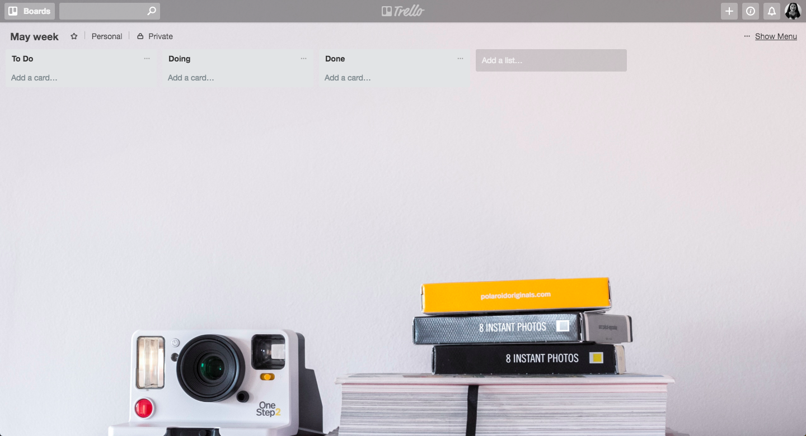

## Trello

Code challenge - Trello

Recreate the Trello website

* How the original Trello website looks like

### Diferent Versions to Recreate:
 
#### Version 1
 
 * I need to show up an input with the text "Add a list..."
 * Whenever the user clicks on the input, it should appear a form.
 * The form needs to be created with a text area and two buttons, one to add the title of the list and the "x" to cancel the task. 

#### Version 2

* When the user clicks the "Save" button it should appear a new box where the list name should be added. 
* Show up a text of "Add a Card", which it will allow the user to add a new card.

#### Version 3
* Once the new card it is added, it should appear a new message (input) that says "Add a List" to the right side of the list already created.

#### Version 4
* Add focus to the input whenever the user clicks "Add a new card".
* A form should appear whenever the usre clicks the button "Add".

#### Version 5
* A new button should appear so the user can add a new card.

#### Version 6 (optional)
* In order to create a new list, the form should appear to the right side of the list already created. 

